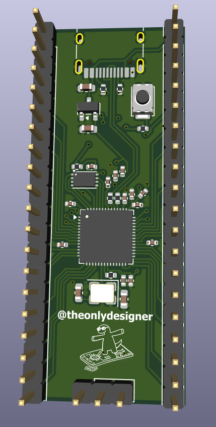

# half life

## project goals
* **Target Specs:** survive a 10-week gauntlet (5 weeks of designing, 5 weeks of building). pump out 5 distinct projects across 5 themes: PCB, CAD, synth, display, and breadboard computer. everything gets documented by lapse so the world can watch me suffer in real time. 
* **Design Philosophy:** the workflow is simple. design something overly ambitious, submit it for the ysws grant, buy the parts, and then panic-build it during the second half of the program. 5 folders, 5 projects, one massive headache. [i am treating each week like an isolated incident so my brain doesn't melt looking at the big picture]
* **Why I'm building this:** hack club's half life ysws sounded like a great way to acquire hardware and entirely surrender my weekends for two and a half months. plus, i already had an old hackpad design laying around that i wanted to merge with a scratch-built RP2040 dev board for week 1.
* **What I have learned:** (to be updated at the end of my build once i survive this)

## bill of materials (BOM)
* note: since this is the master repo for five separate descents into engineering madness, there is no master BOM. each of the 5 project folders has its own README and BOM detailing exactly how much grant money i am burning through for that specific week.

## visual showcase

*(a sneak peek of the week 1 custom RP2040 dev board before i inevitably wire something backwards)*
